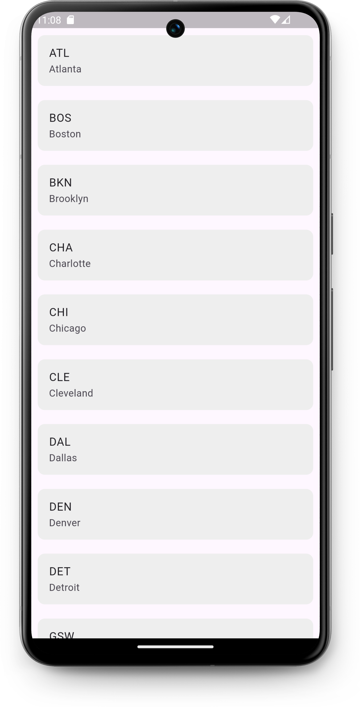

# NBA app
*Read this in other language: [English](README.md), [Русский](README.ru.md)*
## Project Description
This mini-application was created according to [tutorial](https://www.youtube.com/watch?v=MlvqmRXKXyo) to master working with JSON and http on Flutter.

Only the function of reading JSON files from the website https://www.balldontlie.io/#introduction is implemented here.

## Feature List
- Using a public website https://www.balldontlie.io/#introduction to practice working with JSON and http.

## Demo

## Project Installation
1. [Установка Flutter](https://docs.flutter.dev/get-started/install)

2. Cloning a repository
   `git clone https://github.com/karishka1222/NBA-app-Pet-project-on-Flutter.git`

3. Adding dependencies to a project

- `flutter pub get`
- `flutter pub add http`

## Frameworks and technologies used

* Description: Flutter is an open source framework by Google for building beautiful, natively compiled, multi-platform applications from a single codebase.
* Resources:
  * Official Website: [Official Website](https://flutter.dev/)
  * Documentation: [Documentation](https://docs.flutter.dev/)
