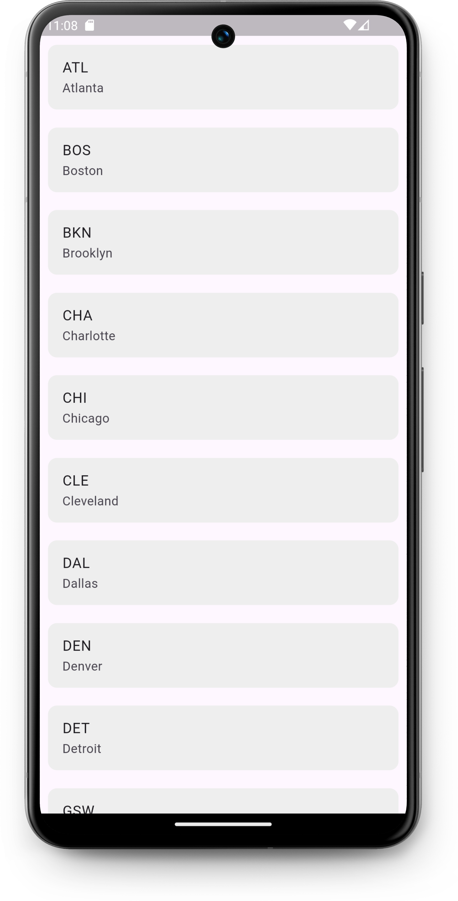

# NBA app

*Прочитать на другом языке: [English](README.md), [Русский](README.ru.md)*
***
## Описание проекта
Это мини-приложение создано по [туториалу](https://www.youtube.com/watch?v=MlvqmRXKXyo) для освоения работы с JSON и http на Flutter. 

Здесь реализованна только функция считывания JSON файлов с сайта https://www.balldontlie.io/#introduction

***
## Особенности
* Использование общедоступного сайта https://www.balldontlie.io/#introduction для практики работы с JSON и http

***
## Демо версия


***
## Установка проекта
1. [Установка Flutter](https://docs.flutter.dev/get-started/install) 

2. Клонирования репозитория
```git clone https://github.com/karishka1222/NBA-app-Pet-project-on-Flutter.git```

3. Добавление зависимостей в проект
* ```flutter pub get```
* ```flutter pub add http```

***
## MIT License
